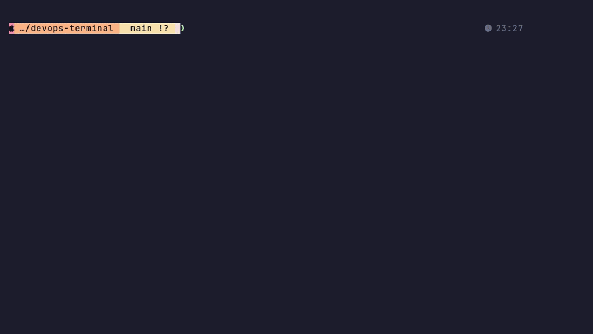

# ⚡ devops-terminal

**Terminal ครบเซ็ตสำหรับ Developer / SRE / DevOps / Platform Engineer — ของฟรีที่ทำให้ terminal เสียตังต้องอาย**

~120 เครื่องมือ + AI + ธีมทั้งระบบ + ระบบดูแลตัวเอง ติดตั้งจบในคำสั่งเดียว เปิด shell ใน **0.07 วินาที**



```sh
bash -c "$(curl -fsSL https://raw.githubusercontent.com/arkashira/devops-terminal/main/install.sh)"
```

รันซ้ำ = update ตัวเอง · ของเดิมใน `~/.zshrc` ไม่ถูกแตะ (เพิ่ม source บรรทัดเดียว) · config เดิม backup เป็น `*.pre-devops-terminal`

## เทียบกับของเสียตัง

| | Warp ($15+/เดือน) | devops-terminal (ฟรี) |
|---|---|---|
| Command Palette | ✅ | ✅ `Ctrl+Space` — คลังคำสั่งส่วนตัว+ทีม |
| Blocks / jump prompt | ✅ | ✅ `Cmd+↑↓` + transient prompt + `lastout` |
| AI ในเทอร์มินัล | ✅ (จำกัด/เสียตัง) | ✅ `ask` `whyfail` `ailog` `Alt+T` + k8sgpt + MCP |
| Autocomplete dropdown | ✅ | ✅ fzf-tab + carapace (1,000+ คำสั่ง) + abbr |
| Theming | ✅ | ✅ Catppuccin ทั้งจักรวาล + cursor shaders 37 ตัว |
| จอสุขภาพ k8s สด | ❌ | ✅ health pill บน tmux bar |
| War room / incident cockpit | ❌ | ✅ `warroom <ns>` |
| ดูแล/ซ่อม/sync ตัวเอง | ❌ | ✅ `termdoctor` `termup` `termsync` |
| Telemetry / บังคับ login | ✅ 😬 | ❌ ไม่มี — เป็นของคุณใน git |

## ไฮไลท์

**🧠 AI ทุกชั้น** — `ask` ถามในจอ · `whyfail` วิเคราะห์คำสั่งพัง · `ailog` เท log หา root cause · `oops <ns>` สรุปความผิดปกติ+AI · `k8sgpt` สแกนคลัสเตอร์ · MCP (aws-knowledge, kubernetes)

**⚡ พิมน้อย ได้มาก** — `Ctrl+Space` palette · `Tab` = fzf dropdown ทุกคำสั่ง (มี preview) · `kgp`→`kubectl get pods` (abbr) · ghost text 3 ชั้น · `Ctrl+R` atuin · `z` zoxide · forgit

**☸️ Kubernetes อาวุธครบ** — k9s (+stern/gonzo ปุ่มเดียว) · kdash · `warroom` · `fkl/fke/fkd/fkpf` เลือก pod แบบ fzf · krew (tree/neat/view-secret/node-shell/capacity) · kor · kubeconform · dyff diff · `lab-up` คลัสเตอร์ซ้อมในเครื่อง (k3d) · prompt เตือน 🔥 สีแดงเมื่ออยู่ prod

**🌐 Network** — `knet` netshoot ในคลัสเตอร์ · nmap · mtr · iperf3 · gping · trippy · doggo · bandwhich · ipcalc · oha load test · httpstat · grpcurl · websocat · `certcheck` · `killport`

**🎨 สวยทั้งระบบ** — Catppuccin: starship powerline (context-aware) · tmux แคปซูล · fzf · bat · btop · lazygit · k9s · eza · syntax highlight · Ghostty (Quick Terminal `Cmd+\``, cursor shaders, holographic icon) · fastfetch · transient prompt

**🔧 ดูแลตัวเอง** — `termdoctor` ตรวจสุขภาพ · `termup` อัปเดต+ซ่อม patch เอง · `termsync` sync ขึ้น repo พร้อมด่านกันข้อมูลหลุด · แจ้งเตือน macOS/มือถือ (ntfy) เมื่องานยาวเสร็จ

**🛠 Dev** — lazygit · delta · difftastic · git-absorb · gh + gh-dash · glab (GitLab) · act · hurl · atac · mprocs · pueue · just · mise · freeze (โค้ด→รูป) · vhs (เทอร์มินัล→GIF) · steampipe (SQL ถาม AWS)

## หลังติดตั้ง

1. เปิด terminal ใหม่ → พิม `keys` (cheat sheet ทั้งหมด) หรือกด `Ctrl+Space` (palette)
2. เปิดแอป **Ghostty** → กด `` Cmd+` `` จากแอปไหนก็ได้ (อนุญาต Accessibility ครั้งแรก)
3. AI: ลง [Kiro CLI](https://kiro.dev) → `kiro-cli login` → `kiro-cli integrations install dotfiles && kiro-cli inline disable`
4. ปรับของส่วนตัว: `AWS_DIR_PROFILES` (auto-switch profile ตามโฟลเดอร์), `abbr add`, `~/.config/sesh/sesh.toml`

## โครงสร้าง

```
install.sh                  # ตัวติดตั้ง idempotent
configs/zshrc.sh            # หัวใจ zsh ทั้งหมด (guard ทุก tool)
configs/tmux.conf           # tmux + catppuccin + floax + health pill
configs/starship.toml       # powerline prompt (k8s/aws/tf context-aware)
configs/ghostty-config      # Ghostty + shaders
configs/term-maintenance.zsh# termdoctor/termup/termsync
configs/*                   # ธีม k9s/lazygit/eza/fastfetch, abbreviations, navi cheats
shaders/                    # cursor_blaze, lightning, fireworks, ...
patches/                    # fix บั๊ก tmux 3.7 × resurrect
assets/demo.tape            # สคริปต์อัด demo.gif (vhs)
```

สร้างด้วย [Claude Code](https://claude.com/claude-code) 🤖 — MIT License
